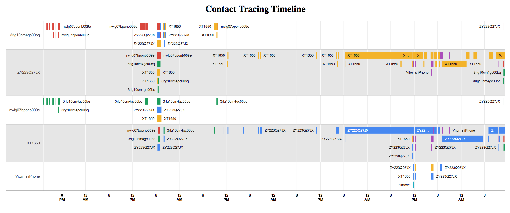

# Basic Bluetooth LE Contact Tracing Dashboard Server

Ultra-simple Ruby server to receive and save bluetooth contact information on PostgreSQL on an internal network (no user token)



## Install

```bash
gem install bundler
bundle install 
```

Create and populate database:

```bash 
rake db:create 
rake db:migrate
```

## Run

```bash
ruby app.rb
```

## Run Tests

```bash
rake db:create RACK_ENV=test
rake db:migrate RACK_ENV=test
rspec -I . ./specs/app_spec.rb
```

## Table Structure

```ruby
Contact(
    uploader,   # uploading ID
    contact,    # contact ID
    start_time, # started seen each other
    end_time,   # stopped seen each other
    rssi        # distance
)
```

See all recorded results (should disable in production)

```
GET http://localhost:4567/api/v1/contacts
```

## How to Post:

```
POST http://localhost:4567/api/v1/contacts
````

With Body:

```json
{ 
  "uploader":  "",
  "contact": "",
  "start_time": "",
  "end_time":  "",
  "rssi": "",
}
````

### Example

Request

```bash
curl -i -X POST -H "Content-Type: application/json" \
       -d'{"uploader":"testWithUpdate", "contact":"conSerial", "date":"2020-03-19T07:22Z", "rssi":-27}'\
       http://localhost:4567/api/v1/contacts
```

Response

```
HTTP/1.1 200 OK
Content-Type: application/json
X-Content-Type-Options: nosniff
Content-Length: 221

{ 
  "id":5, 
  "uploader":"upSerial",
  "contact":"conSerial",
  "start_time":"2020-03-19T07:22:00.000Z",
  "end_time":"2020-03-19T07:25:00.000Z",
  "rssi":-27,
  "created_at":"2020-04-11T18:28:23.636Z",
  "updated_at":"2020-04-11T18:28:23.636Z"
 }
````
